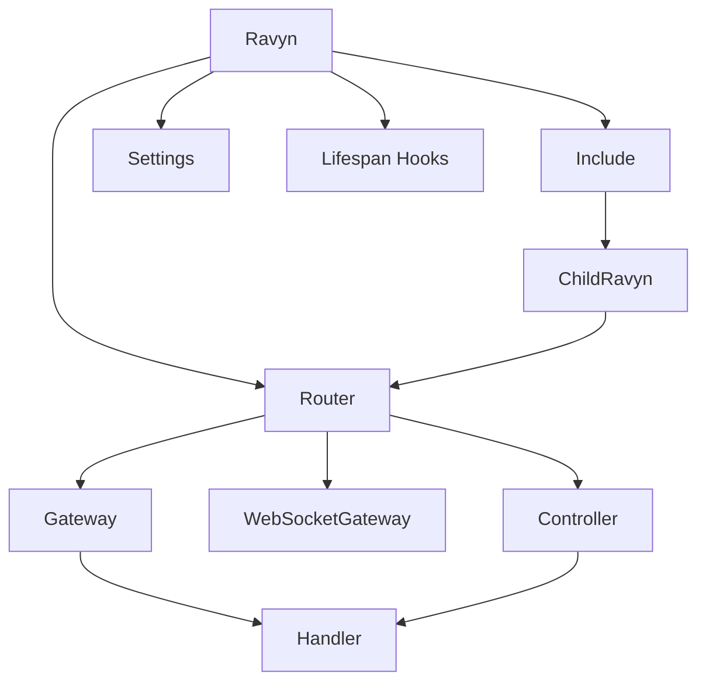

# Component Interactions

This page explains how Ravyn components connect and where responsibilities change.

## Interaction map



## Responsibility boundaries

- **Ravyn**: top-level composition and defaults.
- **Include**: route tree composition by prefix or namespace.
- **Router**: endpoint grouping and local policies.
- **Gateway/Controller**: endpoint definition style.
- **Handler**: request-specific orchestration.

## Typical call path

```text
Ravyn
  -> Include / Router
    -> Gateway / Controller endpoint
      -> dependencies resolve
      -> handler runs
```

## Design guidance

1. Prefer `Include` for domain boundaries (`/users`, `/billing`, `/admin`).
2. Keep routers feature-scoped and small.
3. Use controllers when endpoints share class-level behavior.
4. Keep transport concerns at handler level; move business logic to services.

## Related pages

- [Routing](../routing/index.md)
- [Architecture Patterns](../guides/more-advanced/05-architecture-patterns.md)
- [Dependency Injection](../guides/more-advanced/06-dependency-injection.md)
