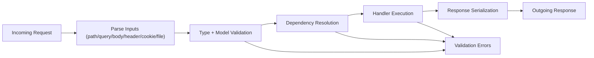

# Data Flow

This page describes how request data becomes validated input and then a response.

## Data flow pipeline



## Flow details

1. **Input parsing**: values are extracted from path/query/body/header/cookie/form.
2. **Validation**: annotations and Pydantic models enforce types and constraints.
3. **Dependency resolution**: injected services/config/context are provided.
4. **Execution**: handler composes application behavior.
5. **Serialization**: return value is normalized into a response.

## OpenAPI relation

Type hints and models influence both runtime behavior and generated docs:

```text
Type hints + Pydantic models
  -> request validation rules
  -> response schema generation
  -> OpenAPI docs
```

## Related pages

- [Requests](../requests.md)
- [Responses](../responses.md)
- [Dependencies](../dependencies.md)
- [OpenAPI](../openapi.md)
