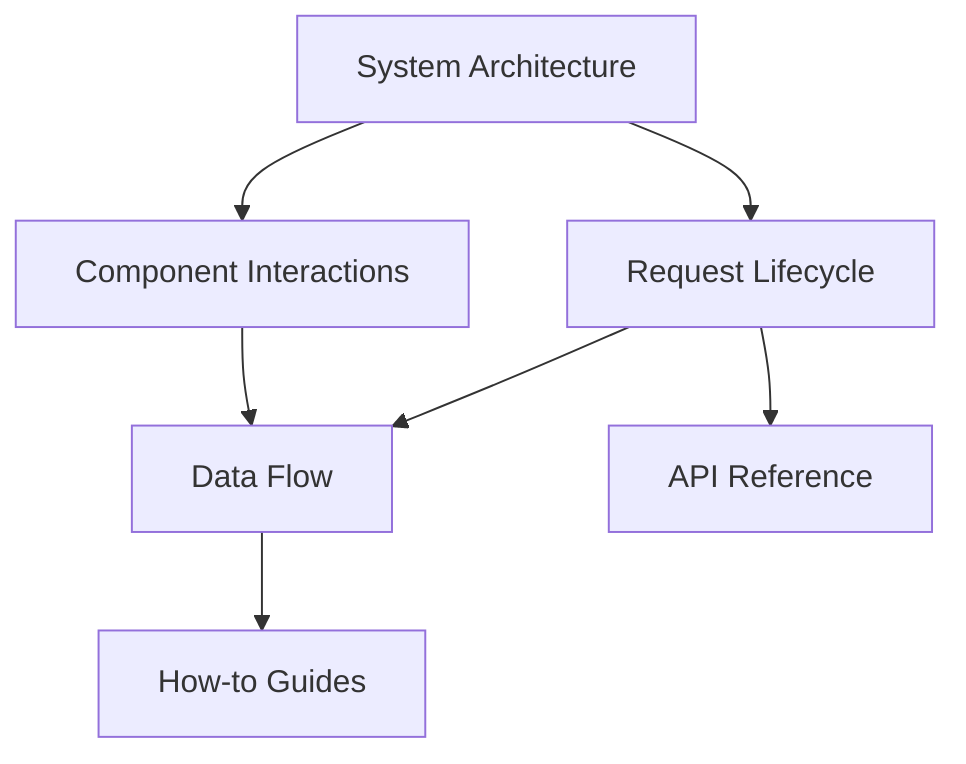

# Concepts

Use this section to understand how Ravyn works before optimizing, scaling, or customizing behavior.

## Why this section exists

Ravyn has many capabilities (routing, DI, middleware, permissions, settings, lifecycles).
Without a conceptual model, teams often use these pieces correctly but inconsistently.

These pages define the shared mental model for:

- request execution flow
- system boundaries
- component responsibilities
- data and validation flow

## Concept map

## Read in this order

1. [System Architecture](./system-architecture.md)
2. [Request Lifecycle](./request-lifecycle.md)
3. [Component Interactions](./component-interactions.md)
4. [Data Flow](./data-flow.md)

## Related sections

- [Tutorials](../tutorials/index.md)
- [How-to Guides](../how-to/index.md)
- [API Reference](../references/index.md)
