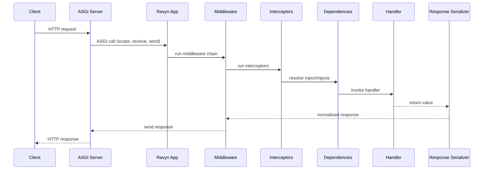

# Request Lifecycle

This page describes what happens from incoming request to outgoing response.

## Lifecycle sequence

## Execution phases

1. **Routing match**: Ravyn selects the matching route path and method.
2. **Pre-handler pipeline**: middleware and interceptors run in configured order.
3. **Dependency resolution**: dependency graph is resolved for handler parameters.
4. **Handler execution**: business logic runs.
5. **Serialization**: output is transformed into the final response type.
6. **Post-handler pipeline**: response returns through middleware stack.

## Where to place logic

- **Middleware**: concerns that need full request+response visibility.
- **Interceptors**: pre-handler concerns (validation, short-circuit checks).
- **Dependencies**: value provisioning and context-aware service wiring.
- **Handlers**: transport-level orchestration, minimal business rules.
- **Services/DAOs**: core business and data access logic.

## Related pages

- [Lifespan Events](../lifespan-events.md)
- [Middleware](../middleware/index.md)
- [Interceptors](../interceptors.md)
- [Dependencies](../dependencies.md)
