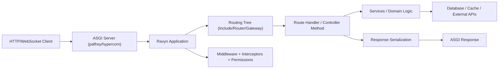

# System Architecture

This page explains Ravyn as a runtime system, not just a set of decorators.

## High-level architecture



## Core layers

1. **ASGI boundary**: server translates network traffic to `scope/receive/send`.
2. **Application boundary**: `Ravyn` owns global config, route tree, and lifecycle hooks.
3. **Execution boundary**: middleware/interceptors/dependencies shape request handling.
4. **Domain boundary**: handlers call services; services call storage/external systems.
5. **Output boundary**: return values become response objects and OpenAPI schemas.

## Ravyn composition model

Use this layering model for large codebases:

```text
Ravyn app (global config and policy)
  -> Include (domain/module grouping)
    -> Router (feature grouping)
      -> Gateway or Controller (endpoint mapping)
        -> Handler (transport boundary)
          -> Service (business boundary)
```

## Related pages

- [Application](../application/index.md)
- [Routing](../routing/index.md)
- [Request Lifecycle](./request-lifecycle.md)
- [Data Flow](./data-flow.md)
