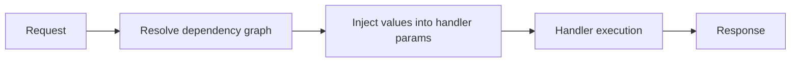

# Dependency Injection Made Simple

Dependency injection helps you write cleaner, more testable code by automatically providing dependencies to your route handlers. Instead of creating database connections or services inside every handler, you define them once and let Ravyn inject them where needed.

## What You'll Learn

- How to inject dependencies into route handlers
- Using `Factory` for class-based dependencies
- Managing dependencies at different application levels
- Advanced patterns with `Requires` and `Security`

## Quick Start

Here's the simplest dependency injection example:

```python
from ravyn import Ravyn, Gateway, Inject, Injects, get

def get_database():
    """This function provides a database connection"""
    return {"db": "postgresql://connected"}

@get()
def list_users(db: dict = Injects()) -> dict:
    """This handler receives the database automatically"""
    return {"users": ["Alice", "Bob"], "db": db}

app = Ravyn(
    routes=[Gateway("/users", handler=list_users)],
    dependencies={"db": Inject(get_database)}
)
```

When someone visits `/users`, Ravyn automatically:

1. Calls `get_database()` to get the dependency
2. Injects the result into the `db` parameter
3. Your handler receives the database connection

!!! tip
    Use `Inject()` to **define** a dependency and `Injects()` to **receive** it in your handler.

---

## How Dependencies Work



### The Two-Part System

Ravyn's dependency injection uses two objects:

1. **`Inject(callable)`** - Defines what to inject (in `dependencies` dict)
2. **`Injects()`** - Marks where to inject it (in handler parameters)

```python
from ravyn import Inject, Injects

# Step 1: Define the dependency
dependencies = {
    "db": Inject(get_database),  # What to inject
}

# Step 2: Receive the dependency
def handler(db = Injects()):  # Where to inject
    return {"db": db}
```

See also [Data Flow](./concepts/data-flow.md) for how dependency resolution fits the full request pipeline.

### Application Levels

Dependencies can be defined at multiple levels. Ravyn reads them **top-down**, with the **last one taking priority**:

```python
from ravyn import Ravyn, Include, Gateway, Inject, Injects, get

def app_level_dep():
    return "app"

def route_level_dep():
    return "route"

@get()
def handler(dep: str = Injects()) -> dict:
    return {"dep": dep}  # Returns "route" (route level wins)

app = Ravyn(
    routes=[
        Include("/api", routes=[
            Gateway("/test", handler=handler)
        ], dependencies={"dep": Inject(route_level_dep)})
    ],
    dependencies={"dep": Inject(app_level_dep)}
)
```

---

## Using Factory for Classes

The `Factory` object is a clean way to inject class instances without manual instantiation.

### Basic Factory Example

```python
from ravyn import Ravyn, Gateway, Inject, Injects, Factory, get

class UserDAO:
    def __init__(self):
        self.db = "connected"

    def get_users(self):
        return ["Alice", "Bob"]

@get()
def list_users(user_dao: UserDAO = Injects()) -> dict:
    return {"users": user_dao.get_users()}

app = Ravyn(
    routes=[Gateway("/users", handler=list_users)],
    dependencies={"user_dao": Inject(Factory(UserDAO))}
)
```

!!! tip
    No need to instantiate the class yourself. just pass the class to `Factory()` and Ravyn handles the rest.

### Factory with Arguments

Pass arguments to your class constructor:

```python
class DatabaseConnection:
    def __init__(self, host: str, port: int):
        self.host = host
        self.port = port

# Using args
dependencies = {
    "db": Inject(Factory(DatabaseConnection, "localhost", 5432))
}

# Using kwargs
dependencies = {
    "db": Inject(Factory(DatabaseConnection, host="localhost", port=5432))
}
```

### Factory with String Imports

Avoid circular imports by using string-based imports:

```python
from ravyn import Factory, Inject

# Instead of importing the class directly
# from myapp.accounts.daos import UserDAO  # Might cause circular import

# Use a string path
dependencies = {
    "user_dao": Inject(Factory("myapp.accounts.daos.UserDAO"))
}
```

This is especially useful in large applications where import order matters.

---

## Chaining Dependencies

Dependencies can depend on other dependencies:

```python
from ravyn import Ravyn, Gateway, Inject, Injects, get

def get_config() -> dict:
    return {"max_connections": 100}

def get_database(config: dict = Injects()) -> dict:
    return {"db": "connected", "max_conn": config["max_connections"]}

def get_user_service(db: dict = Injects()) -> dict:
    return {"service": "UserService", "db": db}

@get()
def list_users(service: dict = Injects()) -> dict:
    return {"users": [], "service": service}

app = Ravyn(
    routes=[Gateway("/users", handler=list_users)],
    dependencies={
        "config": Inject(get_config),
        "db": Inject(get_database),
        "service": Inject(get_user_service),
    }
)
```

Ravyn automatically resolves the chain: `config` → `db` → `service` → `handler`.

---

## Practical Examples

Here are common real-world patterns for dependency injection in Ravyn.

### Database Session Injection

Injecting a database session that automatically closes after the request is a common pattern.

```python
from typing import Generator
from ravyn import Ravyn, Gateway, Inject, Injects, get

class DatabaseSession:
    def query(self, model: str):
        return [f"{model} 1", f"{model} 2"]

    def close(self):
        # Logic to close connection
        pass

def get_db() -> Generator[DatabaseSession, None, None]:
    db = DatabaseSession()
    try:
        yield db
    finally:
        db.close()

@get("/users")
def list_users(db: DatabaseSession = Injects()) -> dict:
    return {"users": db.query("User")}

app = Ravyn(
    routes=[Gateway(handler=list_users)],
    dependencies={"db": Inject(get_db)}
)
```

### Authenticated User Injection

You can inject the current user by inspecting the request headers or cookies.

```python
from typing import Optional
from ravyn import Ravyn, Gateway, Inject, Injects, get, Request

class User:
    def __init__(self, username: str):
        self.username = username

async def get_current_user(request: Request) -> Optional[User]:
    token = request.headers.get("Authorization")
    if token == "secret-token":
        return User(username="admin")
    return None

@get("/me")
def read_current_user(user: Optional[User] = Injects()) -> dict:
    if not user:
        return {"error": "Not authenticated"}
    return {"username": user.username}

app = Ravyn(
    routes=[Gateway(handler=read_current_user)],
    dependencies={"user": Inject(get_current_user)}
)
```

### Configuration Injection

Injecting application settings helps keep your handlers clean and testable.

```python
from ravyn import Ravyn, Gateway, Inject, Injects, get, RavynSettings

class Settings(RavynSettings):
    api_key: str = "default-key"

def get_settings() -> Settings:
    return Settings()

@get("/config")
def read_config(settings: Settings = Injects()) -> dict:
    return {"api_key": settings.api_key}

app = Ravyn(
    routes=[Gateway(handler=read_config)],
    dependencies={"settings": Inject(get_settings)}
)
```

---

## Dependency Scopes and Lifecycle

Understanding when dependencies are created and destroyed is crucial for managing resources like database connections.

### Scopes

Ravyn primarily uses **Request Scope** for dependencies.

1.  **Request-Scoped**: Most dependencies are resolved once per request. If multiple handlers or other dependencies require the same dependency, Ravyn resolves it once and shares the value within that request (if `use_cache=True` is set in `Inject`, which is the default for most systems).
2.  **Singleton/App-Scoped**: Ravyn doesn't have a native "Singleton" scope for individual dependencies, but you can achieve this by instantiating an object at the module level and returning it in your dependency function.

### Lifecycle (Yield Dependencies)

As shown in the Database example, Ravyn supports the `yield` keyword in dependency functions.

1.  **Startup**: The code before `yield` executes.
2.  **Injection**: The yielded value is injected into the handler.
3.  **Teardown**: After the response is sent, the code after `yield` executes.

This ensures resources are properly cleaned up even if an exception occurs during request processing.

---

## Simplified Syntax (Without Inject)

You can skip the `Inject()` wrapper for simple cases:

```python
from ravyn import Ravyn, Gateway, Injects, get

def get_database():
    return {"db": "connected"}

@get()
def users(db: dict = Injects()) -> dict:
    return {"users": [], "db": db}

# Both work the same:
app = Ravyn(
    routes=[Gateway("/users", handler=users)],
    dependencies={"db": get_database}  # No Inject() needed!
)
```

Ravyn automatically wraps callables in `Inject()` for you.

---

## Advanced: Using Requires

`Requires` lets you group multiple dependencies together and add validation logic.

### Basic Requires

```python
from ravyn import Ravyn, Gateway, Requires, get

class AuthRequired(Requires):
    def __init__(self, token: str):
        self.token = token
        if not token:
            raise ValueError("Token required")

@get(dependencies=AuthRequired)
def protected_route(auth: AuthRequired) -> dict:
    return {"message": "Authenticated", "token": auth.token}

app = Ravyn(routes=[Gateway("/protected", handler=protected_route)])
```

### Nested Requires

```python
from ravyn import Requires

class DatabaseRequired(Requires):
    def __init__(self):
        self.db = "connected"

class AuthRequired(Requires):
    def __init__(self, db: DatabaseRequired):
        self.db = db
        self.user = "authenticated_user"

@get(dependencies=AuthRequired)
def handler(auth: AuthRequired) -> dict:
    return {"user": auth.user, "db": auth.db.db}
```

### Requires at Application Level

Use `Requires` with `Factory` for application-level dependencies:

```python
from ravyn import Ravyn, Include, Gateway, Inject, Factory, Injects, get

class DatabaseRequired(Requires):
    def __init__(self):
        self.db = "connected"

@get()
def handler(db: DatabaseRequired = Injects()) -> dict:
    return {"db": db.db}

app = Ravyn(
    routes=[Gateway("/test", handler=handler)],
    dependencies={"db": Inject(Factory(DatabaseRequired))}
)
```

---

## Advanced: Security Dependencies

The `Security` object integrates with Ravyn's security system for authentication and authorization.

!!! warning
    When using `Security` inside `Requires`, you **must** add the `RequestContextMiddleware` from Lilya or an exception will be raised.

```python
from lilya.middleware import DefineMiddleware
from lilya.middleware.request_context import RequestContextMiddleware
from ravyn import Ravyn, Security, Requires

app = Ravyn(
    routes=[...],
    middleware=[DefineMiddleware(RequestContextMiddleware)]
)
```

### Security Example

```python
from ravyn import Security, Requires, get

class JWTAuth:
    async def __call__(self, request) -> dict:
        token = request.headers.get("Authorization")
        if not token:
            raise ValueError("No token provided")
        return {"user": "decoded_user"}

class AuthRequires(Requires):
    def __init__(self, user: dict = Security(JWTAuth)):
        self.user = user

@get(dependencies=AuthRequires)
def protected(auth: AuthRequires) -> dict:
    return {"user": auth.user}
```

Learn more in the [Security](./security/index.md) documentation.

---

## Common Pitfalls & Fixes

### Pitfall 1: Using Inject Instead of Injects in Handler

**Problem:** Handler receives `None` or errors occur.

```python
# Wrong
def handler(db = Inject(get_database)):  # Wrong object!
    return {"db": db}
```

**Solution:** Use `Injects()` (with an 's') in handler parameters:

```python
# Correct
def handler(db = Injects()):  # Receives the injected value
    return {"db": db}
```

### Pitfall 2: Circular Dependencies

**Problem:** Two dependencies depend on each other, causing infinite loops.

```python
# Wrong
def dep_a(b = Injects()):
    return {"a": b}

def dep_b(a = Injects()):
    return {"b": a}

dependencies = {
    "a": Inject(dep_a),
    "b": Inject(dep_b),  # Circular!
}
```

**Solution:** Restructure your dependencies to avoid circular references. Extract shared logic into a third dependency.

### Pitfall 3: Forgetting to Define Dependencies

**Problem:** Handler expects a dependency but it's not defined.

```python
# Wrong
@get()
def handler(db = Injects()):  # Where does 'db' come from?
    return {"db": db}

app = Ravyn(routes=[Gateway("/test", handler=handler)])
# No dependencies defined!
```

**Solution:** Always define dependencies at the appropriate level:

```python
# Correct
app = Ravyn(
    routes=[Gateway("/test", handler=handler)],
    dependencies={"db": Inject(get_database)}  # Defined!
)
```

### Pitfall 4: String Import Path Typos

**Problem:** Using `Factory` with string imports but path is wrong.

```python
# Wrong
dependencies = {
    "dao": Inject(Factory("myapp.wrong.path.UserDAO"))  # Typo!
}
```

**Solution:** Double-check the full module path:

```python
# Correct
dependencies = {
    "dao": Inject(Factory("myapp.accounts.daos.UserDAO"))
}
```

---

## Dependency Injection Patterns Summary

| Pattern | Use Case | Example |
|---------|----------|---------|
| **Simple Function** | Basic dependencies | `Inject(get_config)` |
| **Factory** | Class instances | `Inject(Factory(UserDAO))` |
| **Factory with Args** | Configured classes | `Inject(Factory(DB, host="localhost"))` |
| **String Import** | Avoid circular imports | `Inject(Factory("myapp.dao.UserDAO"))` |
| **Requires** | Grouped dependencies | `class Auth(Requires): ...` |
| **Security** | Authentication/Authorization | `Security(JWTAuth)` |

---

## Next Steps

Now that you understand dependency injection, explore:

- [Routing](./routing/routes.md) - Organize routes with Include
- [Protocols (DAOs)](./protocols.md) - Use Data Access Objects pattern
- [Security](./security/index.md) - Implement authentication
- [Middleware](./middleware/index.md) - Add request/response processing
- [Testing](./testclient.md) - Test handlers with dependencies

{! ../../../docs_src/_shared/exceptions.md !}
