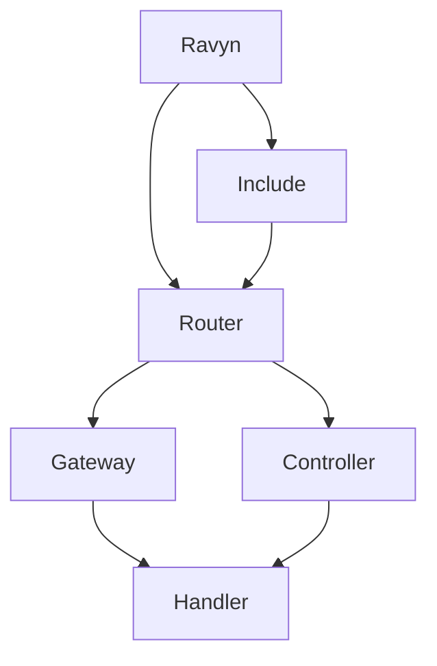

# Routing

Learn how to define routes and handle requests in your Ravyn application.

## Conceptual map

```text
Decorator or Gateway
   -> Router / Include composition
   -> optional middleware/permissions/dependencies
   -> handler execution
```

Use this section when you need to move from a few endpoints to a maintainable route tree.



For a deeper composition view, see [Component Interactions](../concepts/component-interactions.md).

## In This Section

- [Routes](./routes.md) - Gateway, Include, and route organization
- [Handlers](./handlers.md) - HTTP method decorators (@get, @post, etc.)
- [Router](./router.md) - Router configuration and ChildRavyn
- [Controllers](./controllers.md) - Class-based route handlers
- [Webhooks](./webhooks.md) - Webhook endpoints

## Quick Links

### Getting Started

- [Create your first route](./routes.md#quick-start)
- [Use HTTP handlers](./handlers.md#quick-start)
- [Organize with Include](./routes.md#using-include)

### Common Tasks

- [Define GET/POST endpoints](./handlers.md#http-handlers)
- [Group routes](./routes.md#route-organization)
- [Handle WebSockets](./handlers.md#websocket-handler)
- [Create controllers](./controllers.md#quick-start)

### Advanced Topics

- [ChildRavyn applications](./router.md#child-ravyn)
- [Route parameters](./routes.md#path-parameters)
- [Webhook handling](./webhooks.md#quick-start)

## Recommended order

1. [Routes](./routes.md)
2. [Handlers](./handlers.md)
3. [Router](./router.md)
4. [Controllers](./controllers.md)
5. [Webhooks](./webhooks.md)

## Related sections

- [Application](../application/index.md)
- [Permissions](../permissions/index.md)
- [Security](../security/index.md)
