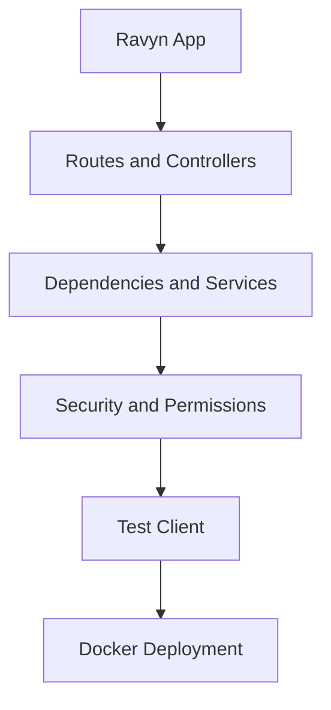

# Build a Production API

This tutorial takes you from a minimal Ravyn app to a production-ready API.

## Outcome

By the end, you will have:

- structured route modules
- validated request/response models
- JWT authentication and permission checks
- test coverage for core endpoints
- deployable container setup

## Prerequisites

- Python 3.10+
- Basic familiarity with HTTP and Pydantic
- `pip install ravyn[standard]`

## Tutorial steps

1. [Bootstrap Project](./01-bootstrap.md)
2. [Routing and Models](./02-routing-and-models.md)
3. [Auth and Permissions](./03-auth-and-permissions.md)
4. [Testing and Deployment](./04-testing-and-deploy.md)

## Architecture preview

## Related pages

- [System Architecture](../../concepts/system-architecture.md)
- [How-to Guides](../../how-to/index.md)
