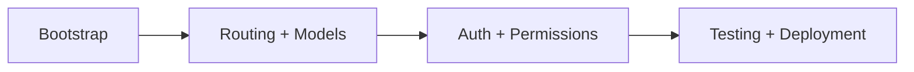

# Tutorials

Tutorials are progressive, end-to-end learning paths.

Use tutorials when you want to build a complete working system and learn Ravyn by doing.

## Recommended sequence

1. [Build a Production API](./build-a-production-api/index.md)

## Learning model

## When to use tutorials vs how-to guides

- **Tutorials**: linear learning path with milestones.
- **How-to guides**: solve one concrete task quickly.

## Related sections

- [Beginner Guides](../guides/beginner/index.md)
- [How-to Guides](../how-to/index.md)
- [Concepts](../concepts/index.md)
