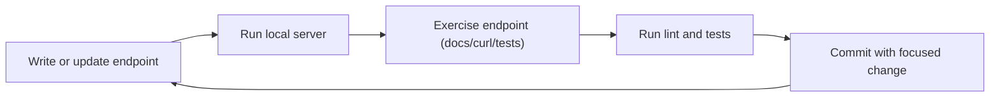

# Local Development Loop

Use this workflow for fast and reliable daily development.

## Loop



## Commands

```shell
# run docs/dev server
hatch run docs:serve

# run tests
hatch run test:test

# run lint and format
hatch run ruff check .
hatch run format
```

## Daily checklist

1. Keep each change small and scoped.
2. Validate OpenAPI output when request/response models change.
3. Add or update at least one test for behavior changes.

## Related pages

- [Test Client](../testclient.md)
- [OpenAPI](../openapi.md)
- [Contributing](../contributing.md)
