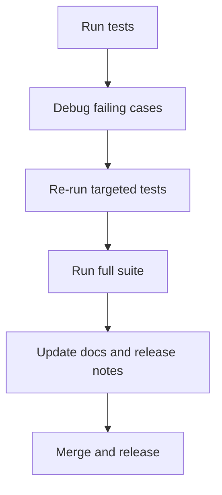

# Testing, Debugging, and Release Workflow

Use this workflow before merging or cutting a release.

## Pipeline

## Recommended process

1. Run targeted tests for changed modules first.
2. Run the full suite before merge.
3. Validate docs for behavior/API changes.
4. Update [Release Notes](../release-notes.md) for user-visible changes.

## Debug checklist

- validate dependency resolution order
- check middleware/interceptor execution order
- inspect generated OpenAPI for schema mismatches

## Related pages

- [Testing Guide](../guides/more-advanced/02-testing.md)
- [Troubleshooting](../troubleshooting.md)
- [Release Notes](../release-notes.md)
